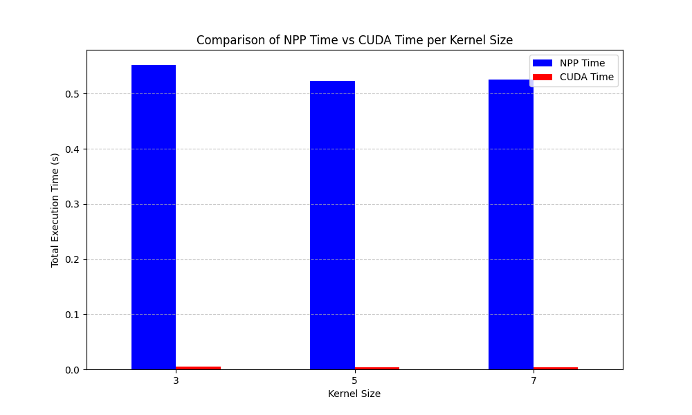

# CUDAatScalefortheEnterpriseProject
## What does this project do ?
Compares the execution time for blurring images using NPP and a Cuda kernel.

## How to build and run
1. Clone the repo and change into the cloned directory
2. Create a build directory and change into it
3. Adjust the follwing lines in the CMakeLists.txt to the correct paths of yout system and set the compute capability of your Cuda device
```
et(CMAKE_CUDA_COMPILER path/to/nvcc)
set(CMAKE_CUDA_TOOLKIT_INCLUDE_DIRECTOR path/to/cuda/include)
set(CMAKE_CUDA_RUNTIME_LIBRARY path/to/libcudart.so)

set(CMAKE_CUDA_ARCHITECTURES cuda_compute_capability)
```
4. Run cmake and compile
```
cmake ..
make
```
5. Change into root project folder and run the run.sh

The output.txt files contains the execution times for each image of NPP and the Cuda Version for different kernel sizes.

## Comparison of execution times

